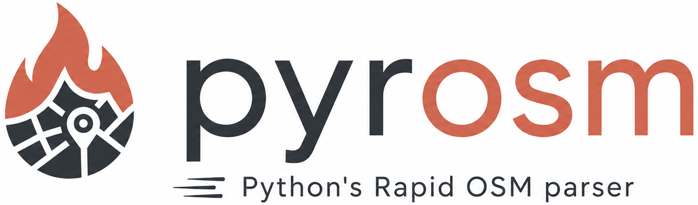

  

# Pyrosm – Python’s Rapid OSM Parser

 

[)](https://pepy.tech/project/pyrosm)

**Pyrosm** is a Python library for reading OpenStreetMap data from Protocolbuffer Binary Format -files (`*.osm.pbf`) into Geopandas GeoDataFrames. 
Pyrosm makes it easy to extract various datasets from OpenStreetMap pbf-dumps including e.g. road networks, buildings, 
Points of Interest (POI), landuse and natural elements. Also fully customized queries are supported which makes it possible 
to parse the data from OSM with more specific filters.
 
**Pyrosm** is easy to use and it provides a somewhat similar user interface as [OSMnx](https://github.com/gboeing/osmnx).
The main difference between pyrosm and OSMnx is that OSMnx reads the data over internet using OverPass API, whereas pyrosm reads the data from local OSM data dumps
that can be downloaded e.g. from [GeoFabrik's website](http://download.geofabrik.de/). The library has been developed by keeping performance in mind, hence, it is mainly written in Cython (*Python with C-like performance*) which makes it fast to parse OpenStreetMap data from PBF files. With the opt-in out-of-core ("streaming") engine added in **v0.10.0**, it is possible to read whole-country (or even continent) extracts quickly without running out of
memory. Pyrosm decodes the PBF data with [Google's Protocol Buffers](https://protobuf.dev/) library (using its fast `upb` C backend). Protocol Buffers is a commonly used and efficient method to serialize and compress structured data which is also used by OpenStreetMap contributors to distribute the OSM data in PBF format (Protocolbuffer Binary Format). 

> **Backend change.** Since **v0.8.0**, the backend used to parse the protocol-buffer messages is [Google's Protobuf](https://protobuf.dev/) (its fast C `upb` backend) instead of the previously used [Pyrobuf](https://github.com/appnexus/pyrobuf). The switch was made for maintainability and installation reliability: Pyrobuf is no longer maintained and its source build fails with modern `setuptools`, which broke `pip install pyrosm`, whereas Google's Protobuf is actively maintained and ships prebuilt wheels and conda-forge packages for Python 3.10–3.14. The change does **not** slow down parsing — see the [backend benchmark](benchmarks/README.md). **v0.7.0 was the last release that used Pyrobuf.**

> **Out-of-core ("streaming") engine (v0.10.0).** Pyrosm now ships an opt-in out-of-core reading engine, selected with `OSM(filepath, engine="out_of_core")`, that decodes large PBF files in a **single streaming pass with bounded memory** — the decode, the node-coordinate gather and the standalone-way read all run **in parallel** across a worker pool, and each layer's result is cached automatically. It reads whole-country and even **whole-continent** extracts (e.g. all of South America) quickly on modest machines without running out of memory, returning GeoDataFrames identical to the default in-memory reader (which is unchanged). 

**Documentation** is available at [https://pyrosm.readthedocs.io](https://pyrosm.readthedocs.io/en/stable/).

## Current features

- download PBF data easily from any location in the world
- find and download the right extract for a bounding box or a place name (NEW in v0.9.0)
- read street networks (separately for driving, cycling, walking and all-combined)
- read buildings from PBF
- read Points of Interest (POI) from PBF
- read landuse from PBF
- read "natural" from PBF
- read boundaries from PBF (such as administrative borders)
- read any other data from PBF by using a custom user-defined filter
- read large PBF extracts (country level, even some continents) with bounded memory using the opt-in out-of-core ("streaming") engine (`engine="out_of_core"`), with parallel decoding and automatic result caching (NEW in v0.10.0)
- filter data based on bounding box
- control which OSM tags are parsed into columns
- crop a PBF to a smaller area and write modified OSM data back to PBF (NEW in v0.9.0)
- export networks as a directed graph to `igraph`, `networkx` and `pandarm`
 
## Install

Pyrosm is distributed via PyPI and conda-forge.

The recommended way to install pyrosm is from conda-forge with [mamba](https://mamba.readthedocs.io/) (or its standalone variant [micromamba](https://mamba.readthedocs.io/en/latest/user_guide/micromamba.html)), a fast drop-in replacement for `conda`. If you don't have it yet, download and install mamba via Miniforge from the [conda-forge download page](https://conda-forge.org/download/) — it ships mamba preconfigured with the conda-forge channel. Then install pyrosm with:

`$ mamba install -c conda-forge pyrosm`

or, with micromamba:

`$ micromamba install -c conda-forge pyrosm`

(the same command works with `conda` if you have it). You can also install the package with pip:

`$ pip install pyrosm`

### Troubleshooting

Notice that `pyrosm` requires geopandas to work. 
On Linux and Mac installing geopandas with `pip` should work without a problem, which is handled automatically when installing pyrosm. 

However, on Windows installing geopandas with pip is likely to cause issues, hence, it is recommended to install Geopandas before installing
`pyrosm`. See instructions from [Geopandas website](https://geopandas.org/install.html#installation).

## When should I use Pyrosm?

Pyrosm can of course be used whenever you need to parse data from OSM into geopandas GeoDataFrames.
However, `pyrosm` is better suited for situations where you want to fetch data for whole city or larger regions (even whole country).

If you are interested to fetch OSM data for smaller areas such as neighborhoods, or search data around a specific location/address,
we recommend using [OSMnx](https://github.com/gboeing/osmnx) which is more flexible in terms of specifying the area of interest.
That being said, it is also possible to extract neighborhood level information with pyrosm and filter data based on a bounding box
(see [docs](https://pyrosm.readthedocs.io/en/latest/basics.html#filtering-data-based-on-bounding-box)).

## How to use?

Using `pyrosm` is straightforward. See [docs](https://pyrosm.readthedocs.io/en/latest/basics.html) 
for instructions how to use the library.

## Get in touch + contributions

If you find a bug from the tool, have question, or would like to suggest a new feature to it, you can [make a new issue here](https://github.com/HTenkanen/pyrosm/issues).

We warmly welcome contributions to `pyrosm` to make it better. If you are interested in contributing to the library,
please check the [contribution guidelines](https://pyrosm.readthedocs.io/en/latest/contributions.html).

## Development

You can install a local development version of the tool by 1) creating an environment with the necessary packages using mamba/micromamba and 2) building pyrosm from source:

 1. create an environment for one of the supported Python versions (3.10–3.14) by:
 
    - e.g. Python 3.14 (you might want to modify the env-name which is `test` by default): `$ mamba env create -f ci/314-conda.yaml` (or `$ micromamba create -f ci/314-conda.yaml`)
    - environment files for other versions are available under `ci/` (e.g. `ci/312-conda.yaml`)
    
 2. build pyrosm development version from master (activate the environment first):
 
    - `pip install -e . --no-build-isolation`
    - (`--no-build-isolation` builds the Cython extensions against the build dependencies provided by the environment, i.e. Cython and `cykhash`, instead of refetching and recompiling them in an isolated build environment)

You can run tests with `pytest` by executing:
 
  `$ pytest . -v` 
  

## Citing pyrosm

If you use pyrosm in your research or other work, please cite it. Pyrosm is archived on [Zenodo](https://doi.org/10.5281/zenodo.3755057), which provides a citable DOI (`10.5281/zenodo.3755057`, always resolving to the latest version). An example citation for the pyrosm version 0.10.0 is as follows:

> Tenkanen, H. (2026). *pyrosm: A Python library for reading and writing OpenStreetMap PBF data with GeoDataFrames*. (v0.10.0) Zenodo. https://doi.org/10.5281/zenodo.3755057

A BibTeX entry and version-specific DOIs are available in the [documentation](https://pyrosm.readthedocs.io/en/latest/citation.html) and on the [Zenodo record](https://doi.org/10.5281/zenodo.3755057).

## License and copyright

Pyrosm is licensed under MIT (see [license](LICENSE)). 

The OSM data is downloaded from two sources:

Data &copy; [Geofabrik GmbH](http://www.geofabrik.de/), [BBBike](https://download.bbbike.org/) and [OpenStreetMap Contributors](http://www.openstreetmap.org/) 

All data from the [OpenStreetMap](https://www.openstreetmap.org) is licensed under the [OpenStreetMap License](https://www.openstreetmap.org/copyright). 

