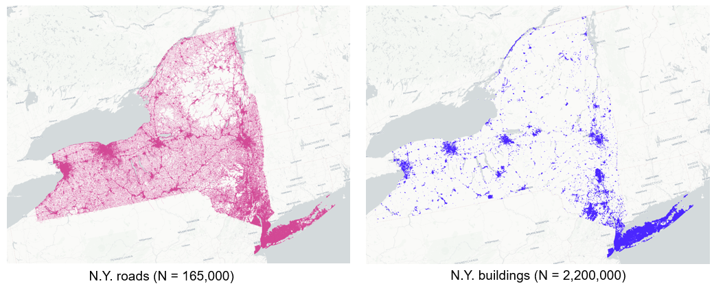

Pyrosm
======

Pyrosm is a Python library for reading OpenStreetMap from protobuf files (*.osm.pbf) into Geopandas GeoDataFrames.
Pyrosm makes it easy to extract various datasets from OpenStreetMap pbf-dumps including e.g. road networks, buildings,
Points of Interest (POI), landuse and natural elements. Also fully customized queries are supported which makes it possible
to parse the data from OSM with more specific filters.

Pyrosm is easy to use and it provides a somewhat similar user interface as OSMnx. The main difference between pyrosm and OSMnx is
that OSMnx reads the data over internet using OverPass API, whereas pyrosm reads the data from local OSM data dumps that can be
downloaded e.g. from GeoFabrik's website. This makes it possible to read data much faster, thus allowing parsing OSM data
covering large regions in a matter of minutes instead of hours.

For instance, parsing all roads from the state of New York (USA) with a basic laptop (16GB memory and SSD),
takes less than **3 minutes** and parsing the buildings from the same region takes approximately
**4.5 minutes** (see benchmarks for details):

Current features
----------------

 - read street networks (separately for driving, cycling, walking and all-combined)
 - read buildings from PBF
 - read Points of Interest (POI) from PBF
 - read landuse from PBF
 - read "natural" from PBF
 - read any other data from PBF by using a custom user-defined filter
 - filter data based on bounding box

.. toctree::
   :maxdepth: 2
   :caption: Getting started

   installation.ipynb
   basics.ipynb
   custom_filter.ipynb
   osm_tags.ipynb
   customized_queries.ipynb
   benchmarking.ipynb

.. toctree::
   :maxdepth: 2
   :caption: Reference Guide

   Reference to All Attributes and Methods <reference>
   Changelog <changelog>

Indices and tables
==================

* :ref:`genindex`
* :ref:`modindex`
* :ref:`search`
