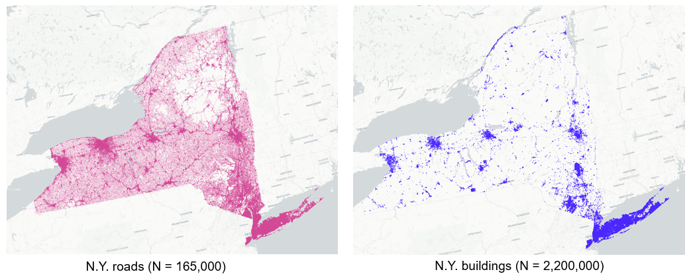

Pyrosm -- Python's Rapid OSM Parser
===================================

Pyrosm is a Python library for reading OpenStreetMap from `Protocolbuffer Binary Format <https://wiki.openstreetmap.org/wiki/PBF_Format>`__ -files (``*.osm.pbf``)
into `Geopandas <https://geopandas.org/>`__ GeoDataFrames.
Pyrosm makes it easy to extract various datasets from OpenStreetMap pbf-dumps including e.g. road networks, buildings,
Points of Interest (POI), landuse, natural elements, administrative boundaries and much more.
Fully customized queries are supported which makes it possible to parse any kind of data from OSM,
even with more specific filters. Getting the data is just as easy: pyrosm allows you to search and download a PBF for any location in the world based on the place name (via geocoding) or by a bounding box.
It can also crop a PBF to a smaller area before reading. Pyrosm is designed for speed, and currently it is one of the 
fastest PBF extraction and cropping tools available (see :doc:`benchmarks <benchmarks/benchmarks_scaling>`). 

Pyrosm is easy to use and it provides a somewhat similar user interface as `OSMnx <https://github.com/gboeing/osmnx>`__.
The main difference between pyrosm and OSMnx is that OSMnx reads the data using an OverPass API, whereas pyrosm reads
the data from local OSM data dumps that are downloaded from the PBF data providers (Geofabrik, BBBike).
This makes it possible to parse OSM data faster and make it more feasible to extract data covering large regions.

Explore a live example below -- building footprints for Lower Manhattan to Midtown, parsed from an
OpenStreetMap PBF with pyrosm and coloured by their construction year (grey = year unknown):

.. raw:: html

   <iframe src="https://pyrosm.github.io/pyrosm/ny_buildings.html"
           title="New York City buildings by construction year, parsed with pyrosm"
           width="100%" height="520" loading="lazy"
           style="border:0; border-radius:8px; margin:0.5em 0;"></iframe>
   

     Interactive map built with <a href="https://developmentseed.org/lonboard/">lonboard</a>
     (deck.gl) &mdash; drag to pan, scroll to zoom, hover a building for its details.
   

.. dropdown:: Show the code that builds this map

   .. literalinclude:: generate_ny_buildings_map.py
      :language: python

Current features
----------------

- download PBF data easily from any location in the world
- find and download the right extract for a bounding box or a place name (NEW in v0.9.0)
- read street networks (separately for driving, cycling, walking and all-combined)
- read buildings from PBF
- read Points of Interest (POI) from PBF
- read landuse from PBF
- read "natural" from PBF
- read boundaries from PBF (such as administrative borders)
- read any other data from PBF by using a custom user-defined filter
- read large PBF extracts (country level, even some continents) with bounded memory using the opt-in out-of-core engine, with parallel decoding and automatic result caching (NEW in v0.10.0)
- filter data based on bounding box
- control which OSM tags are parsed into columns
- crop a PBF to a smaller area and write modified OSM data back to PBF (NEW in v0.9.0)
- export networks as a directed graph to ``igraph``, ``networkx`` and ``pandarm``

When should I use Pyrosm?
-------------------------

Pyrosm can of course be used whenever you need to parse data from OSM into geopandas GeoDataFrames.
However, `pyrosm` is better suited for situations where you want to fetch data for whole city or larger regions (even whole country).

If you are interested to fetch OSM data for smaller areas such as neighborhoods, or search data around a specific location/address,
we recommend using `OSMnx <https://github.com/gboeing/osmnx>`__ which is more flexible in terms of specifying the area of interest and fetching only the data requested via API.
That being said, it is also possible to extract neighborhood level information with pyrosm and filter data based on a bounding box
(see `docs <https://pyrosm.readthedocs.io/en/stable/reading_osm_data.html#filtering-data-based-on-bounding-box>`__).

License
-------

Pyrosm is licensed under MIT (see `license <https://github.com/HTenkanen/pyrosm/blob/master/LICENSE>`__).

Data © `Geofabrik GmbH <http://www.geofabrik.de/>`__, `BBBike <https://download.bbbike.org>`__ and `OpenStreetMap Contributors <http://www.openstreetmap.org>`__.
All data from the `OpenStreetMap <https://www.openstreetmap.org>`__ is licensed under the `OpenStreetMap License <https://www.openstreetmap.org/copyright>`__.

Citation
--------

If you use pyrosm in your work, please cite it. Pyrosm is archived on
`Zenodo <https://doi.org/10.5281/zenodo.3755057>`__ with a citable DOI:

    Tenkanen, H. (2026). *pyrosm: A Python library for reading and writing OpenStreetMap PBF data
    with GeoDataFrames*. (v0.10.0) Zenodo. https://doi.org/10.5281/zenodo.3755057

See :doc:`How to cite pyrosm <citation>` for the full reference and a BibTeX entry.

.. toctree::
    :caption: Getting started

    installation.ipynb
    quickstart.ipynb

.. toctree::
    :caption: User guide

    downloading_data.ipynb
    reading_osm_data.ipynb
    custom_filter.ipynb
    tags_and_columns.ipynb
    saving_and_cropping.ipynb
    graphs.ipynb

.. toctree::
    :caption: Additional info

    faq.md
    benchmarks/benchmarks_scaling.ipynb

.. toctree::
    :caption: API reference

    reference

.. toctree::
    :caption: About

    How to cite <citation>
    contributions
    Changelog <changelog>

Indices and tables
==================

* :ref:`genindex`
* :ref:`modindex`
* :ref:`search`
